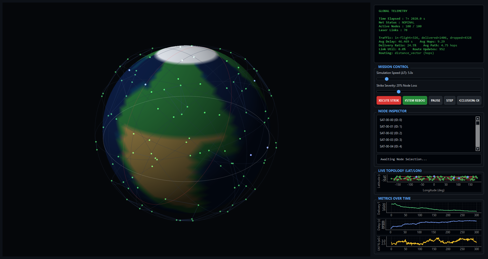

# ASTRA — Autonomous Satellite Traffic & Routing Architecture

ASTRA is a research-oriented satellite constellation simulator focused on **dynamic topology**, **routing**, and **traffic performance** in LEO networks.

It combines:
- **Real orbital propagation (2-body Kepler)** in ECI
- **Physics-valid ISLs** (range + Earth line-of-sight occlusion)
- A clean **network graph** model with link **latency / bandwidth / loss**
- Pluggable **routing algorithms** (Dijkstra + Distance-Vector)
- **Traffic generation** + metrics (delivery ratio, delay, hops, drops)
- Failure/impairment hooks (blackouts, latency spikes, loss scaling) + node strikes

<!-- <div align="center">
  
</div> -->



<br>


## Key Capabilities

* **Orbital physics**: ECI Cartesian state (\(r,v\)) propagated with a universal-variables Kepler solver (`orbit.py`).
* **Earth rotation (ECI→ECEF)**: enables ground-relative satellite subpoint (lat/lon/alt) in the inspector.
* **Clean network model**: topology is recomputed from physics and stored as a graph (`network_model.py`).
* **Link properties**: each ISL has latency (distance/\(c\)), bandwidth (Mbps), and loss probability.
* **Routing is modular** (`routing.py`):
  - Dijkstra shortest path (centralized per-step)
  - Distance-Vector (distributed-style, iterative per-step)
* **Traffic simulation** (`traffic.py`): uniform / hotspot / burst patterns; delivery + delay + hop metrics.
* **Failure scenarios** (`failures.py`): link blackouts, latency spikes, loss scaling; plus node failures via the UI strike.

## Installation & Usage

### Requirements
- Python **3.10+**
- `numpy`
- `PyQt6`
- `pyqtgraph`

```bash
python -m venv venv
venv\Scripts\activate   # Windows PowerShell
pip install numpy PyQt6 pyqtgraph
```

### Run
From the repository folder:

```bash
python main.py
```

Or use the convenience launcher (more robust imports):

```bash
python run.py
```

### Simulating failure / recovery
Use the UI:
- **EXECUTE STRIKE**: disables a percentage of nodes (routing + traffic adapt automatically).
- **SYSTEM REBOOT**: resets nodes and restarts router + traffic state.

## Project structure (current)
- `main.py`: PyQt6 + pyqtgraph UI + simulation loop orchestration
- `orbit.py`: orbital mechanics (COE/state conversion, propagation, ECI→ECEF, LOS)
- `network_model.py`: topology graph and per-link properties
- `routing.py`: routing interface + Dijkstra + Distance-Vector
- `traffic.py`: packet generation, forwarding, and metrics
- `failures.py`: impairments (blackout, latency spikes, loss multiplier)
- `run.py`: launcher

## Notes
- This is a **research simulator**: the models are intentionally simple and modular so you can swap pieces (e.g., add ground stations, queueing, link budgets, GMST).

## License

Copyright © 2024. Licensed under the MIT License. See `LICENSE` for details.
