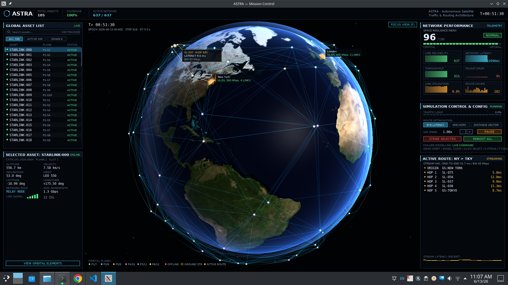

# ASTRA — Autonomous Satellite Traffic & Routing Architecture

ASTRA is a research-oriented LEO satellite-constellation simulator focused on
**dynamic topology**, **routing**, and **traffic performance**, written in
**pure C (C11)** with a hand-rolled **OpenGL** visualization.

It combines:
- **Real orbital propagation (2-body Kepler, universal variables)** in ECI
- **Physics-valid ISLs** (range + Earth line-of-sight occlusion)
- A clean **network graph** with per-link **latency / bandwidth / loss**
- Pluggable **routing** (Dijkstra + Distance-Vector), all-pairs each tick
- **Traffic** generation + metrics (delivery ratio, delay, hops, drops)
- **Failure/impairment** hooks (blackouts, latency spikes, loss scaling) + node strikes
- A lock-free **sim↔render** boundary and a **GLX/EGL** 3D viewer



> ASTRA started as a Python + PyQt6 prototype. It was ported to C, verified
> numerically against the Python (machine-precision parity on orbits, bit-exact
> shortest-path routing), profiled, and the Python was retired. The verified
> parity vectors remain in `tools/` as the regression reference.

## Key Capabilities

* **Orbital physics** (`orbit`): ECI state `(r,v)` via a universal-variables
  Kepler solver; COE↔RV; ECI↔ECEF; spherical geodetic; ray–sphere LOS; elevation.
* **Network model** (`graph`): topology recomputed from physics each step,
  stored as an edge list + CSR with O(1) adjacency; inverse-square link budget.
* **Routing** (`routing`): Dijkstra (lazy heap) and synchronous Distance-Vector,
  producing an all-pairs next-hop table.
* **Ground stations** (`ground`): elevation-masked ground↔satellite links.
* **Traffic** (`traffic`): uniform / hotspot / burst patterns over a zero-alloc
  packet pool with per-link bandwidth budgeting.
* **Failures** (`failures`): link blackouts, latency spikes, loss scaling; plus
  node strikes / system reboot via the command channel.
* **Metrics** (`metrics`): delivery ratio, delay, hops, link utilisation, route
  churn, convergence.
* **Visualization** (`viz`/`gui`): lit graticule globe, ISL/ground links coloured
  by utilisation, satellites + ground stations; headless PNG renders and an
  interactive orbit-camera viewer.

## Build & Run

No build system beyond `make`. Requirements: a C11 compiler, `-pthread`, `libm`;
for the viewer also `libEGL`, `libGL`, `libX11`, `libpng`, and a GL-capable
environment (e.g. Mesa).

```bash
make            # core library + headless apps
make test       # 9 verification tests against the frozen parity vectors
make gui        # build the OpenGL viewer + headless renderer
make viz-test   # visual-correctness golden-image test
```

```bash
# headless performance profile + per-stage breakdown
./build/astra_profile --steps 2000
./build/astra_profile --sweep                  # 100..1024-sat scaling

# network-behavior dataset with a scripted strike + reboot
./build/astra_dataset --strike 200:42 --reboot 400 --csv run.csv --json run.json

# render a frame to PNG (offscreen, no display needed)
./build/astra_render --range 5000 --out frame.png

# interactive viewer (needs a display): drag=orbit, wheel=zoom, P/R/S/Q
./build/astra_gui --range 5000
```

### Viewer controls
Drag = orbit camera, wheel = zoom, **left-click = select a satellite**,
Up/Down (or `[` `]`) = walk the asset list, **S** = strike the selected sat,
**R** = reboot all, **P** = pause, **M** = toggle routing, **Q/Esc** = quit.
The dashboard (asset list, selected-asset readout, latency gauge, performance
meters, and live plots) updates from the running simulation in real time.

Headless failure scripting: `astra_dataset --strike STEP:SAT --reboot STEP`.
Routing and traffic adapt automatically; a strike shows up as a sharp
route-churn spike.

## Verification

`make test` builds and runs the C tests against `tools/*_vectors.txt` — a frozen
snapshot of reference vectors the original Python produced. At parity time the C
matched it to: orbit position 3e-12 km, topology 5e-13 km, Dijkstra next-hop
bit-exact over 30k pairs, Distance-Vector cost 4e-17, ground links exact.
Failure/traffic/metrics modules are invariant-verified (conservation,
reproducibility). The threaded sim↔render boundary is ThreadSanitizer-clean.

## Project structure
- `include/astra/`, `src/` — simulation core (one module per file)
- `tests/`, `tools/*_vectors.txt` — verification tests + frozen reference vectors
- `apps/` — headless tools (`astra_profile`, `astra_dataset`, `astra_physcheck`)
- `viz/`, `gui/` — OpenGL renderer + executables
- `Makefile`, `CLAUDE.md` — build + contributor guide

## Notes
- A **research simulator**: models are intentionally modular so pieces can be
  swapped (RF link budget, J2/drag, GMST, queueing, additional shells).
- The orbital model is currently pure two-body (no J2/drag); an SGP4-vs-real-TLE
  accuracy study is planned to quantify the divergence.

## License
Copyright © 2024. Licensed under the MIT License. See `LICENSE` for details.
